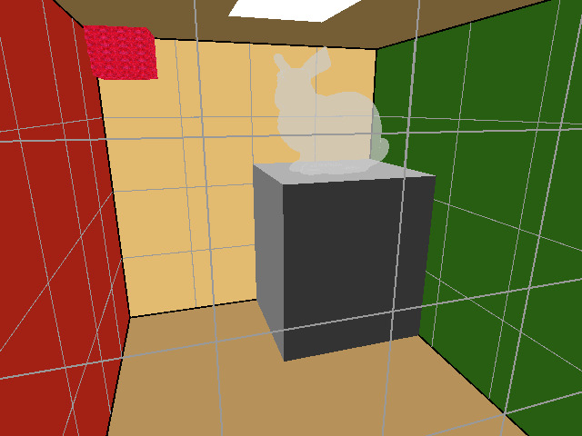

# Jello Cube (C++)
A Jello cube simulation of a mass-spring system as part of the USC CSCI 520 in February 2020.


## Features
#### 1) Mass-Spring Simulation
- Structural springs
- Shear springs
- Bend springs

#### 2) Newton's Law with
- Hook's Law
- Damping
- Collision detection and penalty method
- External force field

#### 3) Integrators
- Euler
- RK4


## Extra Features
#### 1) The Cornell Box scene
#### 2) Obj file handling
- Loading
- Matrix transformation (rotation, translation, scaling)
- Rendering

#### 3) Collision handling with the stanford bunny and a box
#### 4) Transparent stanford bunny
#### 5) Texture mapping
- Please take a close look at the Jello cube


## Environment
Implementation was done in MacOS Catalina.


## Building
#### 1) Open Terminal and go to the project directory.
#### 2) Compile the program:
```
make
```


## Usage
#### 1) In the current directory, execute:
```
./jello world/WORLD_FILE_NAME.w
```
#### 2) Interactions:
- ESC: exit program
- v: switch wireframe/triangle mode
- s: display structural springs on/off
- h: display shear springs on/off
- b: display bend springs on/off
- space: save the current screen to "screenshots", filename index increments automatically
- p: pause on/off
- z: camera zoom in
- x: camera zoom out
- Right mouse button + move mouse: Camera control
- e: reset camera to default position


## Snapshot
#### 1) jello.w



## Course Links
1) USC Viterbi School of Engineering [CSCI 520](http://barbic.usc.edu/cs520-s20/)
2) [Assignment 1](http://barbic.usc.edu/cs520-s20/assign1/)


